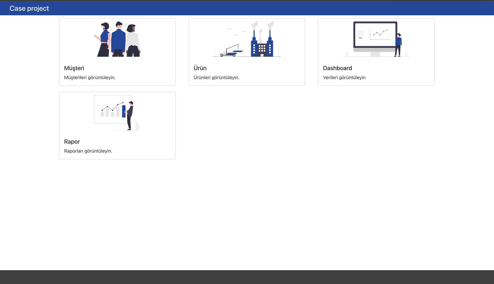
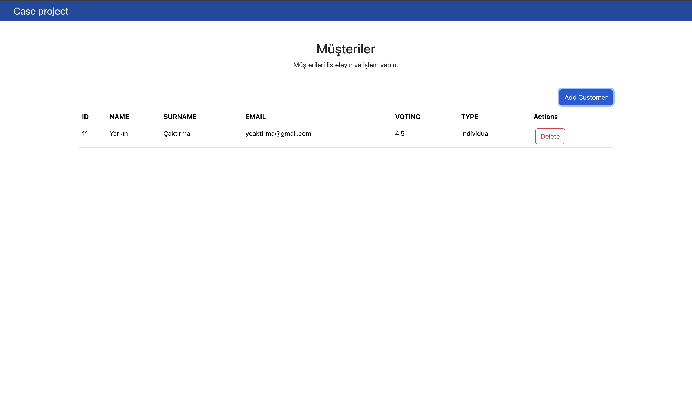
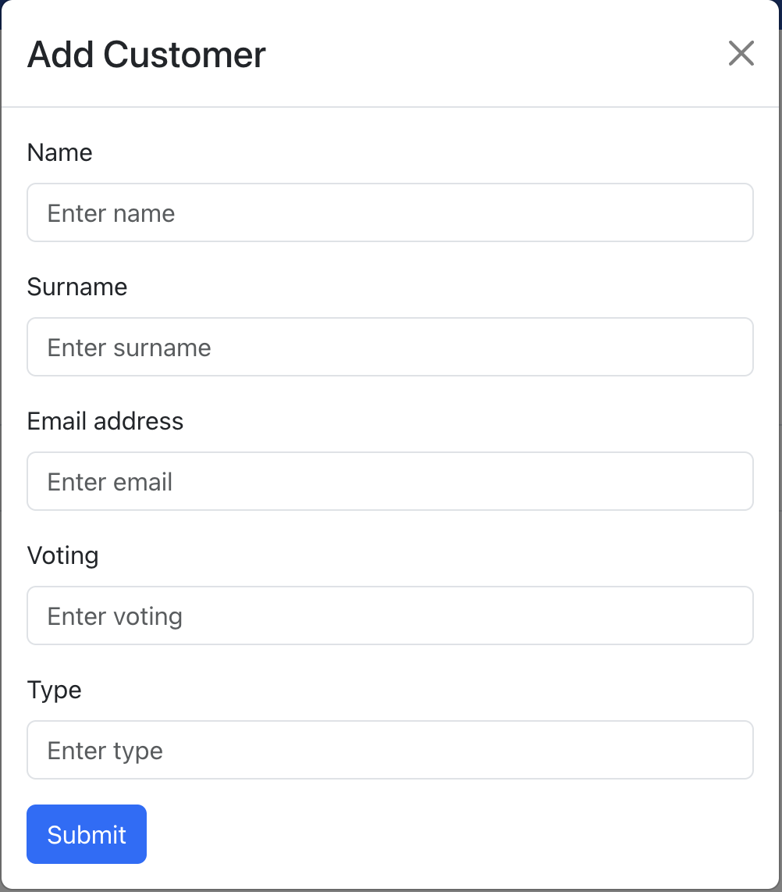
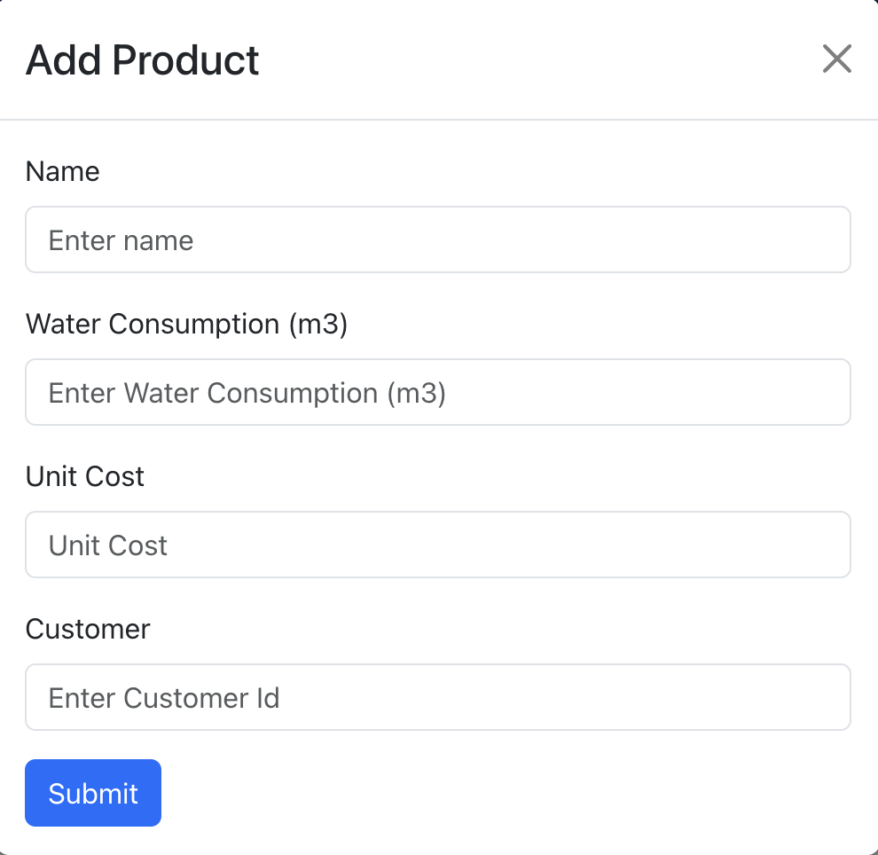
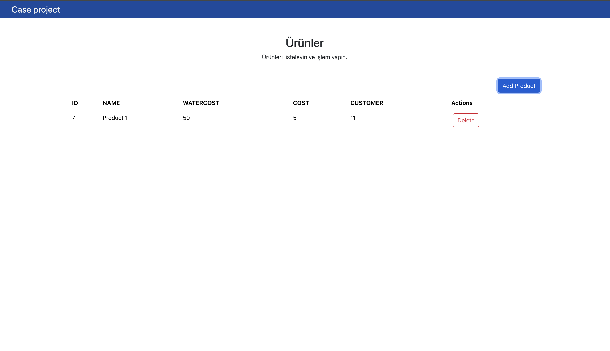
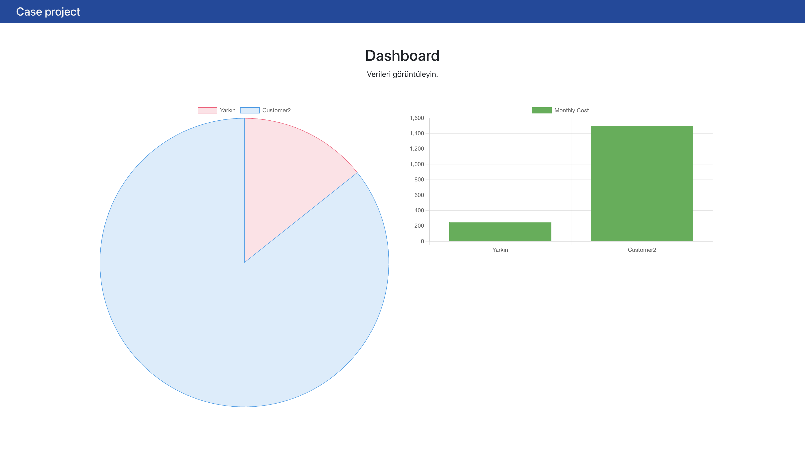

# Case Project
This is a case project.

# Description
Web application using React for the frontend and Django for the backend, following a microservices architecture. Each microservice, such as customerservice, productservice, reportsservice, is contained within separate Docker containers, and a common PostgreSQL database is shared among them. The application can be managed using Docker Desktop.

For the full implementation of the microservices architecture, the database for each service can be separated in the future.

The project is currently in a prototype stage and may have areas that need further development.

# Techs
 - React
 - Django
 - Postgres

# Installation
 1) Download or clone the repo
    ```
        git clone https://github.com/ycaktirma/caseProject.git
    ```
 2) Inside the root folder, run;
    ```
        docker-compose up --build
    ```
 3) Run migrations
    ```
        docker exec -it productService_c python caseProjectServices/manage.py migrate
        docker exec -it customersservice_c python caseProjectServices/manage.py migrate
        docker exec -it reportsService_c python caseProjectServices/manage.py migrate
    ```


# Images






