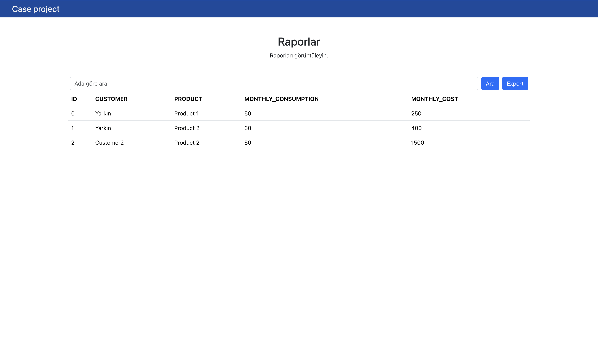

# Case Project
This is a case project.

# Description
Web application using React for the frontend and Django for the backend, following a microservices architecture. Each microservice, such as customerservice, productservice, reportsservice, is contained within separate Docker containers, and a common PostgreSQL database is shared among them. The application can be managed using Docker Desktop.

For the full implementation of the microservices architecture, the database for each service can be separated in the future. This is just a prototype of microservice architecture.

The project is currently in a prototype stage and may have areas that need further development.

# Techs
 - React
 - Django
 - Postgres

# Installation
 1) Download or clone the repo
    ```
        git clone https://github.com/ycaktirma/caseProject.git
    ```
 2) Change directory to project
    ```
        cd caseproject
    ```
 3) Inside the project root folder, run;
    ```
        docker-compose up --build
    ```
 4) Run migrations
    ```
        docker exec -it productService_c python caseProjectServices/manage.py migrate
        docker exec -it customersservice_c python caseProjectServices/manage.py migrate
        docker exec -it reportsService_c python caseProjectServices/manage.py migrate
    ```
 5) Access:
    React App : 
    ```
        http://localhost:3000    
    ```
    Customers Service: 
    ```
        http://localhost:8000/customer    
    ```
    Product Service: 
    ```
        http://localhost:8001/product
    ```
    Report Service: 
    ```
        http://localhost:8002/reports
    ```
    Pgadmin4 for managing databases 
    ```
        http://localhost:5050

        email: ycaktirma@example.com
        password : 123qwe.*
    ```
    Server configuration for pgadmin:
     - Right click on Servers -> Register -> Server
     Go to the connection tab and provide these:
     Host : db
     Username : caseproject_user
     Password : 123qwe.*


# Images



